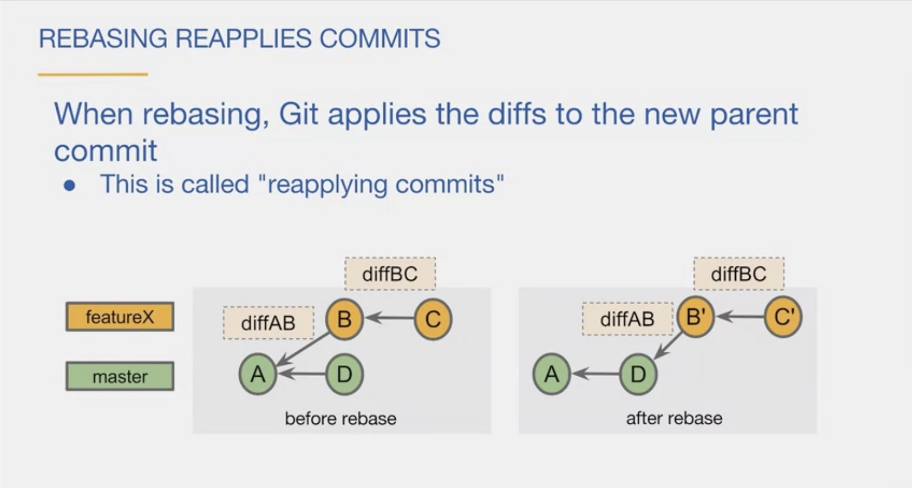
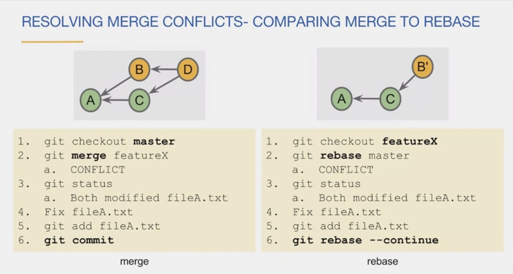

## Overview


## Getting started

### create a new local repo inside a project directory
```
git init
```
your project directory contains
- working tree: location on your computer that contains the directories and files **of a single commit**
- staging area: (index) changed files planned to be included in the next commit
- local repository: all commits of the project on the computer

### clone a remote repository
Create a local copy (project) inside the current directory (and keep in synch with remote repo)
```
git clone \<url\>
```

### configure your user name and email for comitting changes
```
git config --global user.name "myname"
git config --global user.email "my@email.com"
```
### change the default editor
```
git config --global core.editor nano
```

## Do the basics
### create and add files to the local repo 
```
git add .
git add *
```
use "* " to add all changes or use "." to add all files in current directory

### check the status of files changed or untracked
```
git status
```

### commit changes to staging area 
```
git commit -m "commit message"
```

### review recent commits
```
git log --oneline --graph [--all]
```

## Work with branches
Create a branch using and switch to it
```
git checkout -b feature1 
```
Get a list of branches and the active branch. Use --all to include *tracking branch* labels (see below).
```
git branch [--all]
```
Checkout a branch to switch and work on it.
```
git checkout master
```

revert changes using **git revert**

## Merging branches
Merge changes in your *active* branch with another branch using git merge.

### fast forward merge
The master label can be set to the branch head label. The feature branch was a streight continuation of the base branch. No other commits were made to the base branch after the feature branch.

Here are the steps
```
git checkout master
git merge <featurebranch>
git branch -d <featurebranch>
```

### merge commit
The master branch and the feature branch contain both changes, i.e. commits, after branching. A fast forward merge is not possible. The merge combines the commits at the tip of the branches and places it into a new (merge) commit in the master branch. This commit has then two parents. The merge can lead to a **merge conflict**, if both branches contain conflicting changes on the same thing. The merge base, "ours" commit (from master) and "theirs" commit (the feature branch) are used for the merge.

```
git checkout master
git merge <featurebranchlable>
git branch -d <featurebranchlabel>
```
You can force a merge commit with the **--no-ff** flag, even if a fast forward commit would be possible. This allows to see the branching in the commit history.
```
git checkout master
git merge --no-ff <featurebranchlabel>
git branch -d <featurebranchlabel>
```


### merge conflict
Checkout master. Execute merge command. Git detects a conflict and modifies the file(s), for a human to make the decision for what to keep/change. Git markes the hunks in the file with <<<< >>>>. It shows ours and theirs. Update the file and add and commit the file.
```
git checkout master
git merge <featurebranchlabel>
# handle conflict e.g. update feature.py
git add feature.py
git commit
git branch -d <featurebranchlabel>
```


## sqash merge (rewrite commit history)

## rebase (rewrite commit history)

## tracking branch (label)

A tracking branch label is a label to a local branch that represents represents the remote branch (at the last network command, like clone). It's used to keep remote and local repositories in synch. 

E.g. cloning creates a local copy of the remote master branch and it's labels HEAD and master. An additional tracking branch label is created for the default branch e.g. **origin/master**. origin is an alias for the remote repository url. master is the default branch. origin can be used in git commands instead of the origin/master or repo_url/master.

The tracking branch label is only updated with network commands. I.e. local commits and commits in the remote repo are not automatically changing the trancking branch label. 


- The master label represents the tip of the local master branch.
- The origin/master label represents the tip of the tracking branch that tracks the master branch on the remote repository.
- The origin/HEAD label represents the tip of the default branch on the remote repository. The default branch on the remote repository is the master branch.


## Synchronize repository
Network commands. See also **clone** above.

### fetch
Retrieve new objects and references - get remote changes locally without merging.
```
git fetch
```
Tracking branches are updated. 

The find out if local branch and remote are in synch. 
```
git status -v
git log --oneline --graph --all
```

### pull
Combines *git fetch* and *git merge FETCH_HEAD*. The tracking branch will be merged into the local branch. Default merge option is --ff (fast forward merge). It can also be --no-ff to force a merge commit (instead ff) if possible.

Pull only merges, when you have no uncommitted changes.

### push 
Add commits to a remote repository i.e. synchronises local changes to a remote repository. 
```
git push -u origin bug-fix-typo
```
The -u option creates a tracking branch i.e. keeps track of the branch with remote repo.

Recommended, to do a fetch or pull before a push.

*Note: you need to authenicate to the repo during the first push. For GitHub use a generated access token as password (developer settings/token ...) and for Gitbucket use a generated app password (code/token: profile/personal settings/App passwords).*

## rebase
This changes the commit history of the repo. Dont use it, when someone else works on the changes. Rebasing changes commit ids. Rebasing changes the parent of a commit.

In case of conflicts, you can decide to resolve or abort the rebase.


## Terminology

- upstream == remote 

- remote repository == all commits of the project in the cloud (single source of truth)
```
git remote --verbose
```

- git id == object id == object name ... is a sha-1 hash, that identifies a object (commit).
- HEAD and main are **references** to a git commit object. Can be used instead the id. You can use the first 4+ characters of an id, instead the full id.
- **HEAD** is normally a reference to a branchlabel that points to the last commit of a branch - e.g. master, featureX ... 
- A **detached HEAD** references a specific commit directly (instead a branch label). So - checkout the branch with new branchlabel ... will make HEAD pointing to the label i.e. the last commit of that branch

You can show the last n commits by specifying, how many commits you are interested in-
```
git log --oneline -1
```
results in
```
23e343 (HEAD -> master) commit text
```

- branch == a unique path of commits ... The default branch is called **master**
- branch label == is also reference to the last commit in the path ("**tip of the branch**"), i.e. implements a reference. Deleting a branch label only deletes the label - not the commits/the branch.

- tags can be leightweight or **annotated** (recommended). Tags are a reference to a specific commit. They are not automatically pushed to the remote repo. Use:
```
git tag -a -m "Version 1.0" v1.0 HEAD
git push --tags
git push v1.0
```

## Help

### get help for a command

```
git help branch
git help commit
git help add
```
